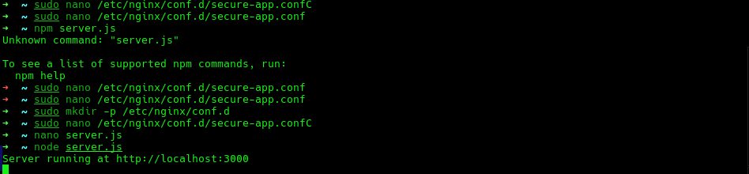
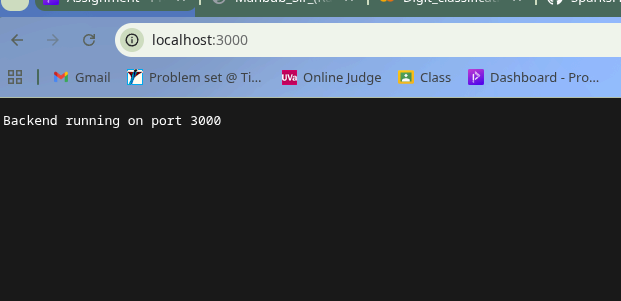
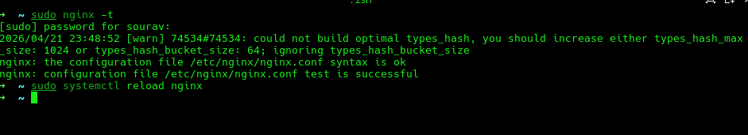

# 📦 Nginx HTTPS + Reverse Proxy Setup (Assignment Submission)

## 👨‍💻 Project Overview

This project demonstrates how to configure an **Nginx web server** with:

* Static website hosting
* HTTPS using self-signed SSL certificate
* HTTP → HTTPS automatic redirection
* Reverse proxy to backend (port 3000)

---

##  System Setup

### 1. Install Nginx

```bash
sudo pacman -S nginx
```

Start and enable service:

```bash
sudo systemctl start nginx
sudo systemctl enable nginx
```

Check status:

```bash
sudo systemctl status nginx
```

---

##  Project Directory Setup

### 2.  Create Web Root

```bash
sudo mkdir -p /var/www/secure-app
```

Create index file:

```bash
sudo nano /var/www/secure-app/index.html
```

Example content:

```html
<h1>Secure Nginx Server Running 🚀</h1>
```

---

##  SSL Certificate Setup

### 3. Create SSL Directory

```bash
sudo mkdir -p /etc/nginx/ssl
```

### 4. Generate Self-Signed SSL Certificate

```bash
sudo openssl req -x509 -nodes -days 365 -newkey rsa:2048 \
-keyout /etc/nginx/ssl/secure.key \
-out /etc/nginx/ssl/secure.crt
```

**Important inputs:**

* Country: **BD**
* Common Name: **localhost**

---

##  Nginx Configuration

Edit main config:

```bash
sudo nano /etc/nginx/nginx.conf
```

Or create site-specific config:

```bash
sudo nano /etc/nginx/conf.d/secure.conf
```

---

###  Full Nginx Config

```nginx
server {
    listen 80;
    server_name localhost;

    # HTTP → HTTPS Redirect
    return 301 https://$host$request_uri;
}

server {
    listen 443 ssl;
    server_name localhost;

    ssl_certificate /etc/nginx/ssl/secure.crt;
    ssl_certificate_key /etc/nginx/ssl/secure.key;

    root /var/www/secure-app;
    index index.html;

    location / {
        try_files $uri $uri/ =404;
    }

    # Reverse Proxy Example (Backend: 3000)
    location /api/ {
        proxy_pass http://localhost:3000;
        proxy_set_header Host $host;
        proxy_set_header X-Real-IP $remote_addr;
    }
}
```



---

## Restart Nginx

Test configuration:

```bash
sudo nginx -t
```

Restart service:

```bash
sudo systemctl restart nginx
```

---

## Backend Server (Example)

If using Node.js backend:

```bash
node server.js
```

Backend runs on:

```
http://localhost:3000
```

---

## 🔍 Testing

### HTTPS Test

Open browser:

```
https://localhost
```

### HTTP Redirect Test

```
http://localhost → automatically redirects to https://localhost
```

### Reverse Proxy Test

```
https://localhost/api/
```

---

##  Screenshots Required

Include in submission:

### 1. SSL Certificate Generation

Terminal output of OpenSSL command

### 2. Nginx Config (Redirect part)

```nginx
return 301 https://$host$request_uri;
```



### 3. HTTPS Working Page

Browser showing secure site



### 4. Reverse Proxy Working

API response via `/api/`

---

## 📂 Project Structure

```
nginx-secure-reverse-proxy/
│── README.md
│── server.js
│── nginx.conf (optional)
│── index.html (optional)
│── ssl/ (optional, usually not uploaded)
```

---

## 📌 Git Commands

```bash
git init
git add .
git commit -m "Nginx HTTPS setup with reverse proxy"
git branch -M main
git remote add origin <your_repo_link>
git push -u origin main
```

---

## 🎯 Important Notes

* ✅ SSL is self-signed (browser warning is normal)
* ✅ Always test with `nginx -t` before restart
* ✅ Ensure port 80 & 443 are open
* ✅ Update SSL certificate details as needed

---

## 🔗 Reference Links

* [Nginx Official Documentation](https://nginx.org/en/docs/)
* [OpenSSL Documentation](https://www.openssl.org/docs/)
* [Nginx Reverse Proxy Guide](https://nginx.org/en/docs/http/ngx_http_proxy_module.html)

---

